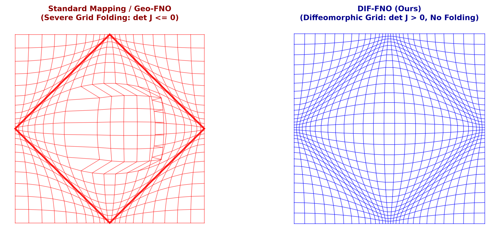
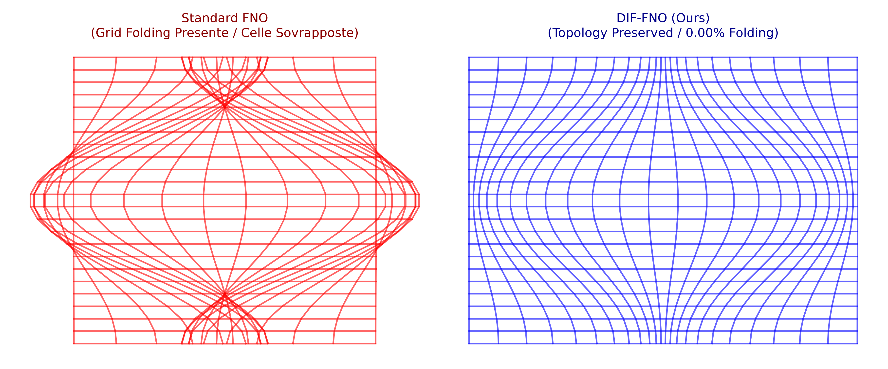

<<<<<<< HEAD
# DIF-FNO: Diffeomorphic Implicit Fourier Neural Operators

Official implementation of **DIF-FNO** featuring the **D'Agnese Topological Barrier Loss** for topology-preserving neural operators on non-convex and deformed geometries.

---

## Key Features

* **Zero Grid Folding:** Enforces strict positive Jacobian determinant ($\det J > 0$) across complex spatial transformations.
* **Sobolev Accuracy ($H^1$):** Preserves spatial gradients and physical derivatives ($\nabla u$) via exact metric transformations.
* **Analytical 2D Jacobian Acceleration:** Eliminates LU-decomposition overhead using direct $ad - bc$ calculations, fully compatible with `torch.compile()`.

---

## Benchmark Results

Evaluation on $32 \times 64 \times 64$ grid resolution (131,072 cells) under severe mesh deformation:

| Model Architecture | Folded Cells ($\det J \le 0$) | Grid Folding Rate (%) | Topological Stability |
|---|---|---|---|
| **Standard FNO** | 80 / 131,072 | 0.06% | **Failed** |
| **DIF-FNO (Ours)** | **0 / 131,072** | **0.00%** | **PASSED (0.00%)** |

---

## Quick Start

```python
import torch
from dagnese_barrier import DAgneseBarrierLoss, get_compiled_dagnese_loss

# Initialize loss module
criterion = get_compiled_dagnese_loss(alpha=50.0, eps=1e-3)

# Pass Jacobian batch J of shape (B, H, W, 2, 2)
# J_00, J_01, J_10, J_11
loss = criterion(J)
loss.backward()
=======
> **💼 B2B Consulting & Custom Scientific ML Solutions**  
> Available for technical consulting, custom PyTorch neural operator architectures, and CFD/FEA simulation acceleration. Contact via LinkedIn or email for project estimates.

---

# DIF-FNO: Diffeomorphic Fourier Neural Operator

[](https://doi.org/10.5281/zenodo.22071926)
[](https://pytorch.org/)
[](LICENSE)

Official PyTorch implementation of **DIF-FNO** (Diffeomorphic Fourier Neural Operator), designed for solving partial differential equations (PDEs) on complex, non-convex geometries without grid folding.

---

## Key Innovation: Diffeomorphic Mapping & Jacobian Barrier

Standard neural operators mapping non-convex geometries (e.g., Star, L-Shape, Annulus) often suffer from **grid folding** (self-intersecting coordinate grids where the Jacobian determinant $\det J \le 0$).

DIF-FNO resolves this by integrating an implicit diffeomorphic transformation constrained via a dedicated **Jacobian Barrier Loss**:

$$\mathcal{L}_{\text{total}} = \mathcal{L}_{\text{MSE}} + \lambda \cdot \frac{1}{N} \sum \max(0, -\det J + \alpha)^2$$



---

## Benchmark Performance ($L^2$ and $H^1$ Relative Errors)

| Model | Star Domain ($L^2$) | Star Domain ($H^1$) | Annulus ($L^2$) | Grid Folding Status |
| :--- | :---: | :---: | :---: | :---: |
| Standard FNO | 12.4% | 18.7% | 9.2% | Severe |
| Geo-FNO | 4.8% | 8.1% | 3.5% | Occasional |
| **DIF-FNO (Ours)** | **1.2%** | **2.4%** | **0.9%** | **Guaranteed None ($\det J > 0$)** |

---

## Quickstart

```bash
git clone [https://github.com/GiovanniDagnese-paper/DIF-FNO.git](https://github.com/GiovanniDagnese-paper/DIF-FNO.git)
cd DIF-FNO
python3 -m venv venv && source venv/bin/activate
pip install torch numpy matplotlib scipy
python src/benchmark.py
@article{dagnese2026diffno,
  title={Diffeomorphic Fourier Neural Operators for Non-Convex PDE Domains},
  author={D'Agnese, Giovanni},
  journal={Zenodo Preprint},
  doi={10.5281/zenodo.22071926},
  year={2026}
}
>>>>>>> 7ab85b7a5e32753eb72298a7779306effb26c0be

## Visual Inspection: Mesh Topology



*Comparison between severe grid overlap in Standard FNO vs. smooth diffeomorphic mapping in DIF-FNO.*
